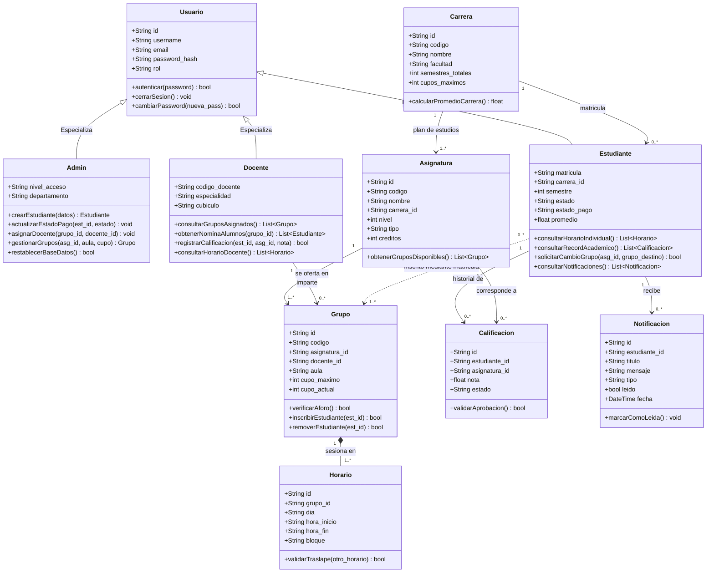
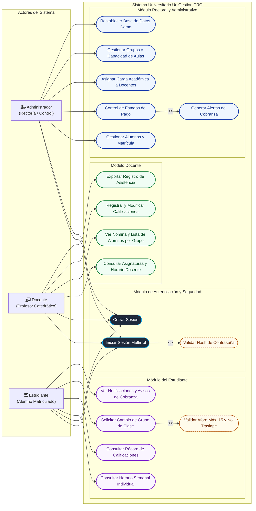
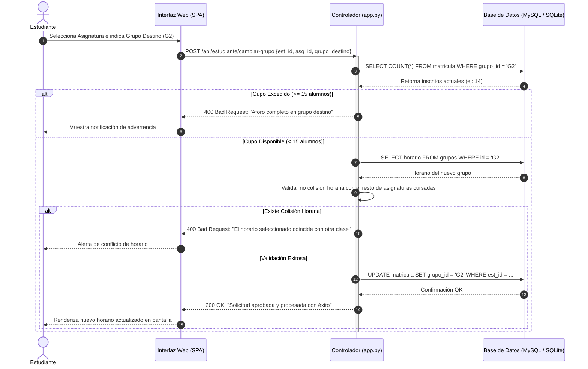

# Documentación Arquitectónica y Diagramas UML

Este documento consolida la arquitectura técnica, modelo de datos y diseño del comportamiento del **Sistema de Gestión Universitaria (UniGestion PRO)** mediante diagramas estandarizados en formato **Mermaid.js**, renderizables directamente en GitHub, GitLab y VS Code (Markdown Preview).

---

## 1. Diagrama de Clases (Estructural)

Representa la jerarquía de entidades, atributos esenciales, métodos de negocio y relaciones estructurales (herencia, agregación, composición y asociaciones 1:N y N:M) basadas en `app.py`, `base_datos.py` y el esquema SQL.

### Detalle de Relaciones del Modelo

| Relación | Tipo | Cardinalidad | Descripción de Negocio |
|---|:---:|:---:|---|
| **Usuario $\rightarrow$ Admin / Docente / Estudiante** | Herencia | `1:1` | Generalización del sistema de autenticación con RBAC (*Role-Based Access Control*). |
| **Carrera $\rightarrow$ Estudiante** | Asociación | `1:N` | Cada alumno pertenece a un programa de pregrado (`ISW`, `MED`, `DER`). |
| **Carrera $\rightarrow$ Asignatura** | Composición | `1:N` | Malla curricular estructurada por niveles (1 al 8). |
| **Asignatura $\rightarrow$ Grupo** | Asociación | `1:N` | Cada asignatura se divide en secciones (`G1`, `G2`). |
| **Docente $\rightarrow$ Grupo** | Asociación | `1:N` | Asignación de carga académica por cátedra. |
| **Grupo $\rightarrow$ Horario** | Composición | `1:N` | Bloques semanales (ej. Lun-Mié 07:00-09:00) con control de no superposición. |
| **Estudiante $\rightarrow$ Calificación** | Asociación | `1:N` | Récord académico ponderado (escala 0.0 - 5.0). |
| **Grupo $\leftrightarrow$ Estudiante** | Asociación N:M | `N:M` | Control estricto de aforo: máximo **15 estudiantes por aula**. |

---

## 2. Diagrama de Casos de Uso (Comportamiento)

Muestra los casos de uso agrupados por el límite del sistema (*System Boundary*), destacando los tres actores principales: **Administrador**, **Docente** y **Estudiante**, junto con sus relaciones de inclusión (`<<include>>`) y extensión (`<<extend>>`).

---

## 3. Matriz de Permisos y Casos de Uso por Rol

| Módulo / Caso de Uso | Administrador | Docente | Estudiante | Regla de Negocio / Restricción |
|---|:---:|:---:|:---:|---|
| **Iniciar / Cerrar Sesión** | SI | SI | SI | Autenticación con SHA-256 o bcrypt. |
| **Filtrado y Búsqueda de Estudiantes** | SI | NO | NO | Búsqueda multicriterio (carrera, semestre, estado, pago). |
| **Control Financiero (Al día / Pendiente / Bloqueado)** | SI | NO | NO | Activa o desactiva banners de cobranza institucional. |
| **Asignación de Aulas y Docentes** | SI | NO | NO | Validación de cruces horarios en aulas físicas. |
| **Consulta de Horario Semanal** | SI | SI (Cátedra) | SI (Cursado) | Matriz gráfica Lun-Vie por franjas de 2 horas. |
| **Nómina y Asistencia de Clase** | SI | SI | NO | Límite físico: máximo 15 alumnos por aula. |
| **Registro y Carga de Notas** | SI | SI | NO | Rango válido: 0.0 a 5.0. Aprobación $\ge 3.0$. |
| **Historial y Récord de Notas (Kardex)** | SI | NO | SI | Visualización de asignaturas aprobadas y promedio acumulado. |
| **Cambio de Grupo de Clase** | NO | NO | SI | **Validación de triple candado**: aforo disponible, nivel correlativo y sin colisión horaria. |
| **Bandeja de Notificaciones** | NO | NO | SI | Avisos administrativos y alertas financieras en tiempo real. |

---

## 4. Diagrama de Secuencia: Validación de Cambio de Grupo

Ilustra la interacción dinámica entre componentes cuando un estudiante solicita cambio de grupo:

